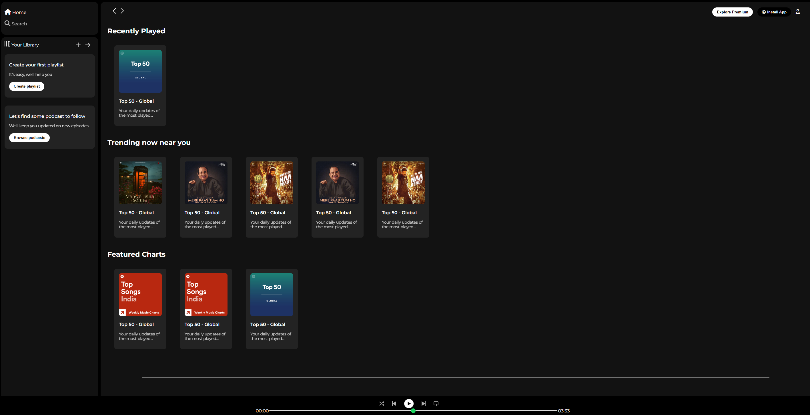

## Spotify-Clone(HTML-CSS)

- **Project Type**: A static clone of the Spotify web player interface.

- **Description**: A front-end replica of Spotify's web player, focusing on the UI layout including a sidebar for navigation, main content area with playlists/artists, and a music player footer. It mimics the look and feel of Spotify without functional audio playback.

- **Technologies Used**:
  - HTML5 (structure for sidebar, navigation, playlists, and player controls).
  - CSS3 (styling for layout, colors, fonts, and responsiveness; uses flexbox/grid for alignment).
  - Font Awesome (for icons like home, search, play/pause).
  - Google Fonts (Montserrat font for text).

- **Key Features**:
  - **Sidebar Navigation**: Includes Home, Search, Your Library, and playlist creation prompts.
  - **Main Content**: Displays playlists, artists, and cards (e.g., "Create your first playlist," "Browse podcasts").
  - **Music Player Footer**: Mock player controls (play, pause, volume, progress bar) with album art and song info.
  - **Responsive Design**: Layout adjusts for different screen sizes (though primarily desktop-focused).
  - **Visual Elements**: Spotify-like color scheme (green accents), images from Assets folder, and hover effects.

- File Structure:
  - **index.html**: Main HTML file with sections for sidebar, main content, and footer.
  - **style.css**: CSS for styling the entire interface.
  - **Assets/**: Folder with images (e.g., logo.png, library_icon.png, album covers).
  - **HomeworkAssets/**: Additional assets (possibly for homework or extras).

- **How to Run**: Open index.html in a web browser. The interface is static, so no interactivity beyond scrolling/hovering.

- **Learning Outcomes**: Focuses on replicating complex UI layouts with HTML/CSS, using external assets, and structuring a music app interface.

